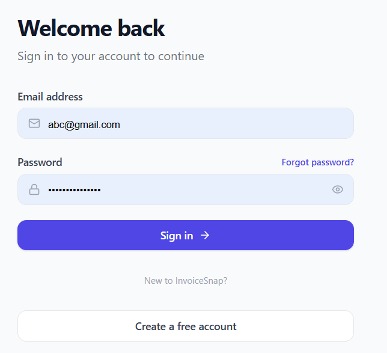
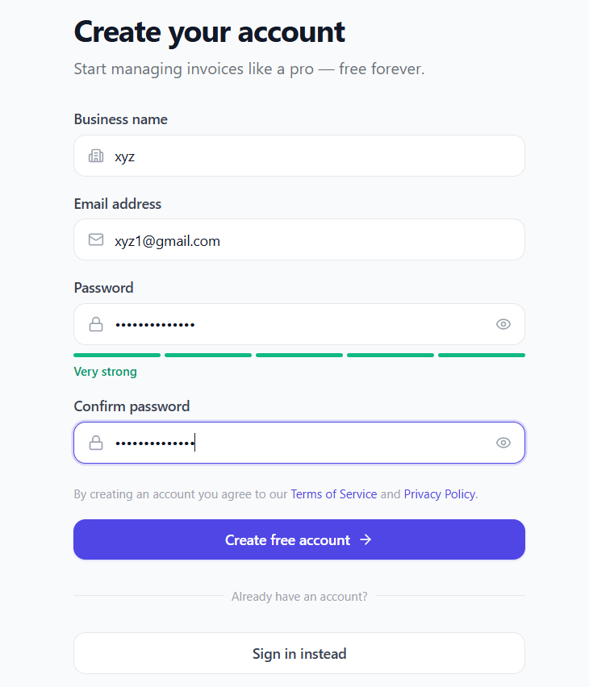
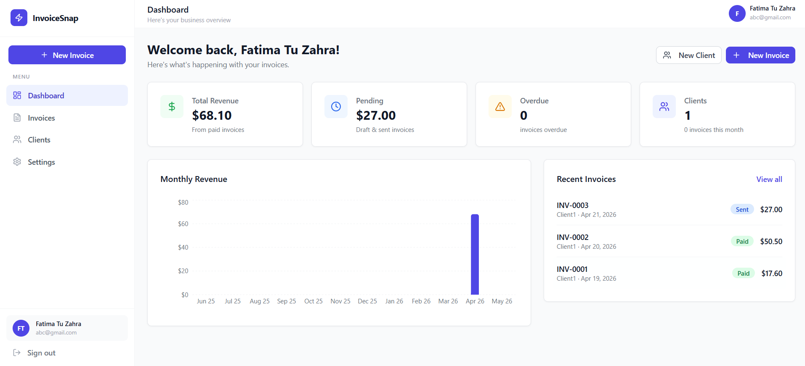
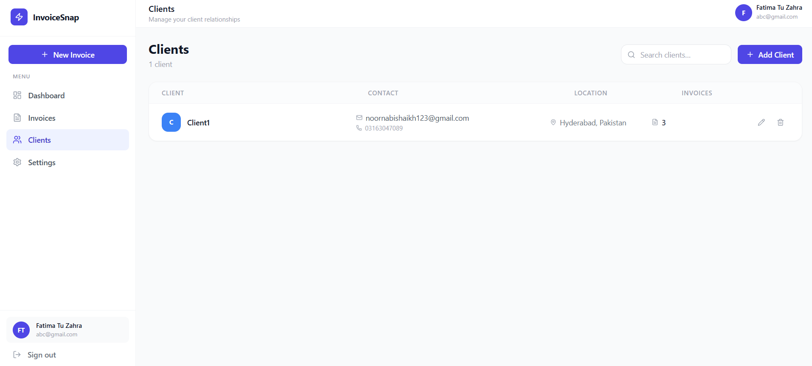
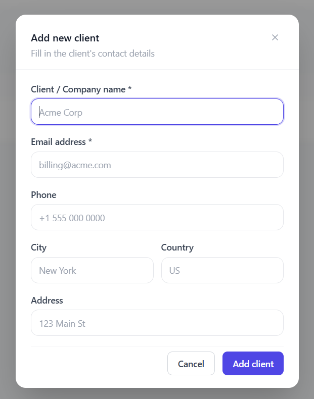
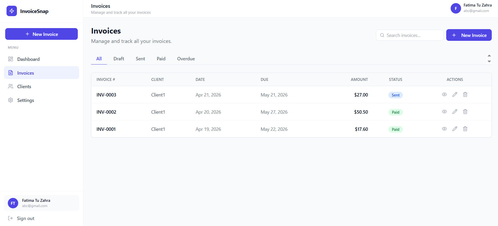
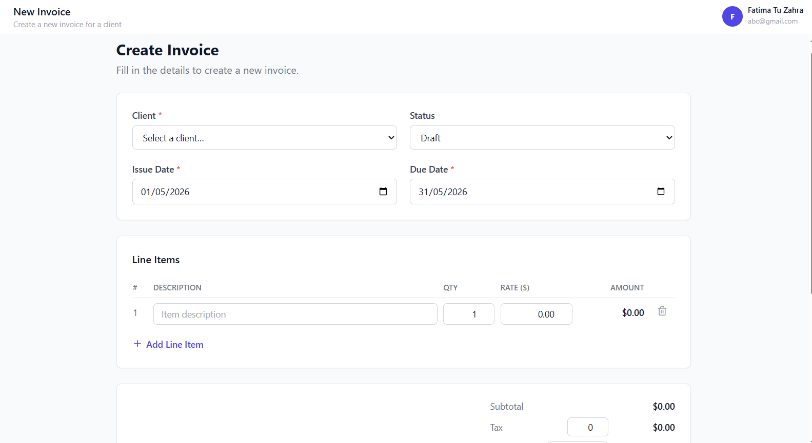
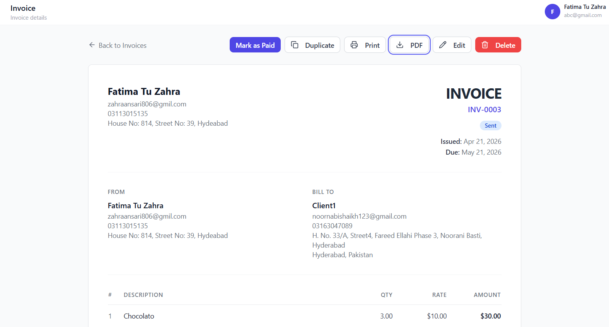
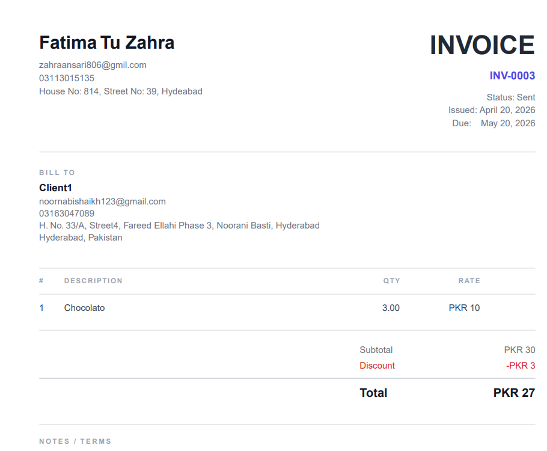
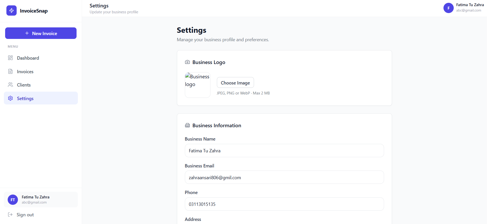

# InvoiceSnap

A full-stack invoice management application built with React, Node.js, and PostgreSQL — fully containerized with Docker for one-command deployment.

---

## Tech Stack

**Frontend:** React 18 · TypeScript · Tailwind CSS · Vite · React Router · Axios · Recharts

**Backend:** Node.js · Express · TypeScript · PostgreSQL · pg (raw SQL) · JWT Authentication · PDFKit

**Deployment:** Docker · Docker Compose · Nginx (reverse proxy) · Ubuntu Server (VirtualBox)

---

## Features

- **Authentication** — Register, login, and JWT-based session management
- **Dashboard** — Revenue analytics, invoice stats, recent activity, and interactive charts
- **Client Management** — Full CRUD with search and contact details
- **Invoice Builder** — Dynamic line items, auto-calculated totals, tax, and discounts
- **Invoice Lifecycle** — Create → Send → Mark as Paid with status tracking and filters
- **PDF Generation** — Download professional invoices as PDF
- **User Settings** — Update profile and business information
- **Dockerized Deployment** — Single command deploys database, API, and frontend

---

## Screenshots

### Login & Registration

| Login | Register |
|-------|----------|
|  |  |

### Dashboard



### Client Management

| Client List | Add Client |
|-------------|------------|
|  |  |

### Invoice Management

| Invoice List | Create Invoice |
|-------------|----------------|
|  |  |

| Invoice View | Invoice PDF |
|-------------|-------------|
|  |  |

### Settings



---

## Project Structure

```
invoice-snap/
├── client/                  # React frontend
│   └── src/
│       ├── components/      # Reusable UI components
│       ├── pages/           # Route pages
│       ├── hooks/           # Custom React hooks
│       ├── services/        # API service layer
│       ├── context/         # Auth context provider
│       └── types/           # TypeScript interfaces
│
├── server/                  # Express backend
│   └── src/
│       ├── routes/          # API route handlers
│       ├── middleware/      # Auth & error middleware
│       ├── config/          # Database connection
│       └── utils/           # PDF generation, helpers
│   ├── migrations/          # SQL schema files
│   └── scripts/             # Startup & migration runner
│
├── docker/                  # Docker configuration
│   ├── Dockerfile.client    # Multi-stage React → Nginx build
│   ├── Dockerfile.server    # Node.js API build
│   └── nginx.conf           # Reverse proxy config
│
├── docker-compose.yml       # Service orchestration
├── .env.example             # Environment variable template
└── .dockerignore            # Build context filter
```

---

## Quick Start

### Prerequisites

- [Docker](https://docs.docker.com/get-docker/) and Docker Compose installed

### Deploy

```bash
# Clone the repository
git clone https://github.com/YOUR_USERNAME/invoice-snap.git
cd invoice-snap

# Create environment file
cp .env.example .env
# Edit .env with your values (especially DB_PASSWORD and JWT_SECRET)

# Build and start all services
docker compose up --build -d

# Verify everything is running
docker compose ps
```

Open `http://localhost` (or `http://<VM_IP>`) in your browser.

### Environment Variables

| Variable | Description | Example |
|----------|-------------|---------|
| `DB_NAME` | PostgreSQL database name | `invoice_snap` |
| `DB_USER` | Database username | `postgres` |
| `DB_PASSWORD` | Database password (no special characters) | `SecurePass_2025` |
| `JWT_SECRET` | Token signing key (use `openssl rand -hex 32`) | `a8f2e1b9c3d4...` |
| `JWT_EXPIRES_IN` | Token expiry duration | `7d` |
| `VITE_API_URL` | API base URL for frontend | `/api` |

---

## API Endpoints

| Method | Endpoint | Description |
|--------|----------|-------------|
| POST | `/api/auth/register` | Register new user |
| POST | `/api/auth/login` | Login and receive JWT |
| GET | `/api/clients` | List all clients |
| POST | `/api/clients` | Create a client |
| PUT | `/api/clients/:id` | Update a client |
| DELETE | `/api/clients/:id` | Delete a client |
| GET | `/api/invoices` | List all invoices |
| POST | `/api/invoices` | Create an invoice |
| GET | `/api/invoices/:id` | Get invoice details |
| PUT | `/api/invoices/:id` | Update an invoice |
| PATCH | `/api/invoices/:id/status` | Change invoice status |
| DELETE | `/api/invoices/:id` | Delete an invoice |
| GET | `/api/invoices/:id/pdf` | Download invoice PDF |
| GET | `/api/dashboard/stats` | Dashboard statistics |

---

## Useful Commands

```bash
# Stop the application (keeps data)
docker compose down

# Restart the application
docker compose up -d

# View server logs
docker compose logs -f server

# Update after code changes
git pull origin main
docker compose up --build -d

# Backup database
docker compose exec db pg_dump -U postgres invoice_snap > backup.sql

# Full reset (deletes all data)
docker compose down -v
docker compose up --build -d
```

---

## Architecture

```
Browser ──► Nginx (port 80)
              ├── /           → Serves React static files
              ├── /api/*      → Proxies to Express (port 5000)
              └── /invoices/* → Serves index.html (SPA routing)
                                    │
                              Express API
                                    │
                              PostgreSQL (port 5432)
                                    │
                              Docker Volume (pgdata)
```


---

## License

This project was built as a learning exercise in full-stack development and Docker deployment.
